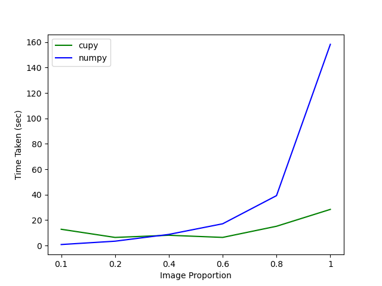

# Demo: Segmentation on CPU and GPU

This is a demonstration of the performance benefits of using SciPy, scikit-learn
and scikit-image on GPUs (AMD or NVIDIA) using Array API.

## Running the demo

First login to Docker Registry

```bash
export CR_PAT=YOUR_PERSONAL_ACCESS_TOKEN_FOR_GITHUB
echo $CR_PAT | docker login ghcr.io -u USERNAME --password-stdin

```


### On NVIDIA GPU

```
docker run --gpus all -it -p 8788:8788 ghcr.io/quansight-labs/amd-demo-cuda:latest bash
```

and then run jupyterlab inside the container:

```
jupyter lab --ip=0.0.0.0 --port=8788 --allow-root
```

### On AMD GPU

```
docker run -it --device=/dev/kfd --device=/dev/dri --security-opt seccomp=unconfined --group-add video ghcr.io/quansight-labs/amd-demo-amd:latest bash
```

and then run jupyterlab inside the container:

```
jupyter lab --ip=0.0.0.0 --port=8788 --allow-root
```


Now run the `plot_coin_segmentation.ipynb` notebook.


### Running Segmentation Performance script

Get into the docker container for either of the above mentioned GPU platform
and run the following script:

```
python segmentation_performance.py
```


This will run the segmentation for various proportions of the greek coins
image for cupy and numpy array, i.e. on CPU and GPU.

This will also create a plot of the performance comparison between numpy and cupy,
which would look something like:


